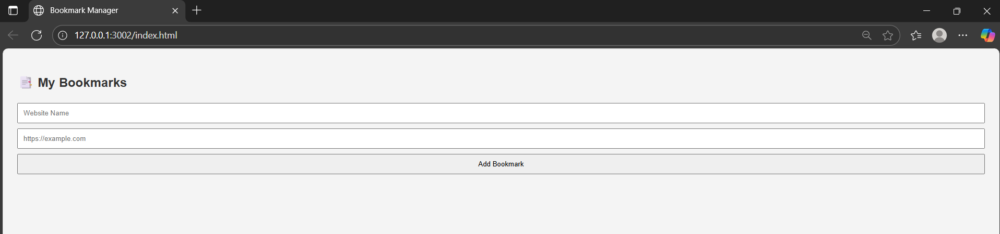

# 📑 Bookmark Manager

A simple and clean web-based application that allows you to **save, view, and delete bookmarks** of your favorite websites — built using **HTML, CSS, and JavaScript**. Bookmarks are stored using the browser's `localStorage`, so your list stays saved even after refreshing the page.

---

## 🚀 Features

- ✅ Add a website name and URL
- ✅ Open bookmarks in a new browser tab
- ✅ Delete bookmarks easily
- ✅ Stores data in `localStorage`
- ✅ Clean, responsive, and minimal design

---

## 📸 Screenshot

---

## 🔧 Technologies Used

- HTML5
- CSS3
- JavaScript (Vanilla)
- Browser LocalStorage API

---

## 💻 How to Run

1. Clone or download this repository
2. Open `index.html` in your browser
3. Start saving your favorite bookmarks!

---

## 🌐 Live Demo

👉 [Click here to view live](https://github.com/Kushagra0310/bookmarks-manager.git).
